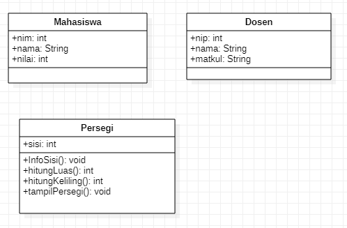

~ Latihan 1

1)	Identifikasi, ada berapa class yang akan dibuat dari sistem diatas?
Jawab :
Ada 2 class yaitu mahasiswa dan dosen

2) 	Implementasikan class dalam bahasa pemrograman java.
Jawab :
1.

2.

~ Latihan 2

	Tambahkan secara lengkap attribute pada setiap class yang sudah Anda identifikasi pada latihan sebelumnya (Latihan 1)?

1.
2.

~latihan 3 

Hasil generate  : 

~screenshot staruml: 

