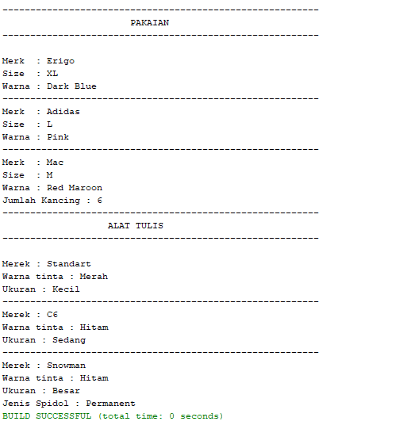
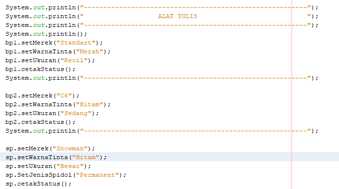
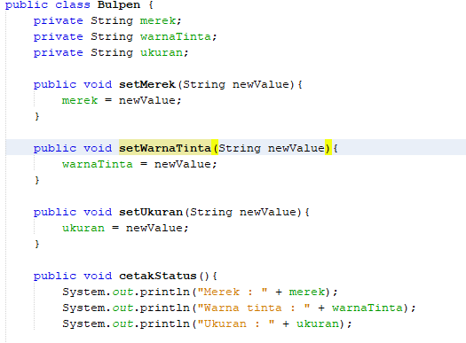
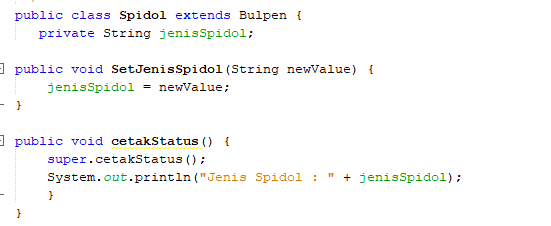
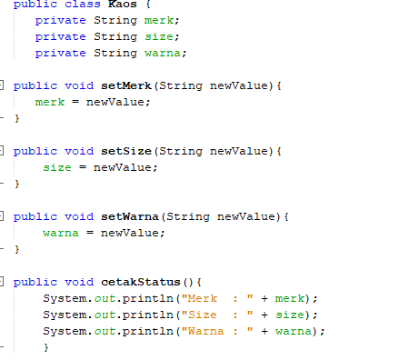
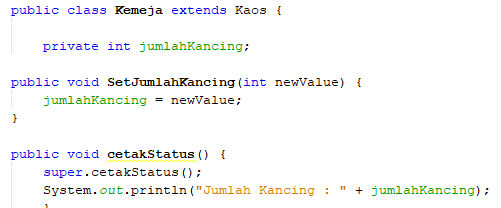

1. output program :

2. ss codingan : 

~ 

~ 

~ 

~ 

~ 

~ 

3. penjelasan program : ada 4 objek dimana masing" 2 benda dari keempat objek tersebut saling berkaitan. disini saya memiliki objek kaos dan kemeja yang sama" memiliki state merk,size dan warna namun kemeja memiliki 1 state yang berbeda yaitu jumlah kancing sama haknya dengan objek saya yang lain yaitu bulpen dan spidol dimana perbedaan state yang dimiliki spidol yaitu pada jenis spidolnya.Keempat objek yang terbagi dalam 4 class masuk dalam 1 main